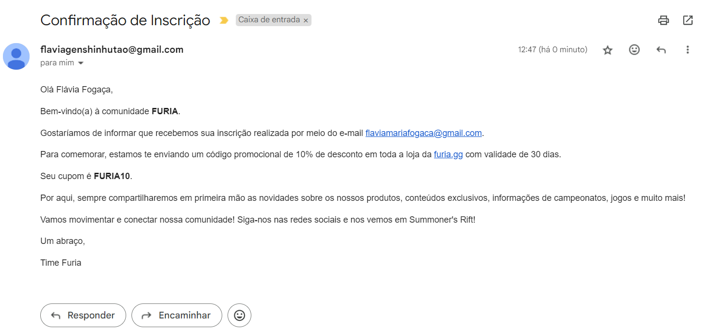
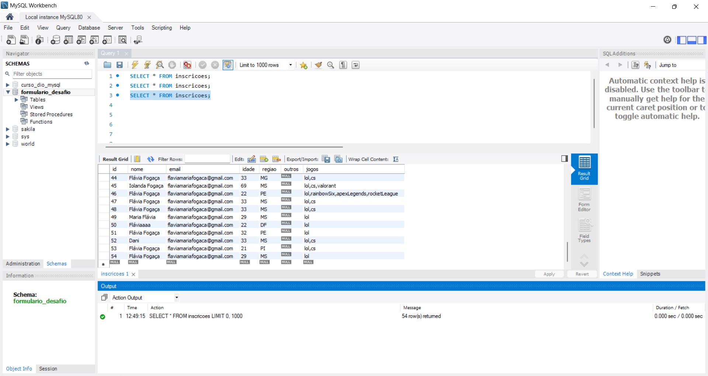

<h2 align="center"> Desafio Furia - Criação de Landing Page </h2>

### 💻 Descrição do Projeto

Esse projeto consiste em criar uma landing page da Furia com o objeitvo de aumentar a comunidade da Furia junto aos apaixonados por League of Legends".

### 📝 Requisitos de elaboração 

A criação da Landing Page foi livre.

### 🚀 Tecnologias utilizadas 

<ul>
    <li>Figma (utilizado para criar os protótipos de interfaces, para desktop e mobile, e que foram replicados com HTML, CSS e JavaScript.)
    <li>HTML, CSS e JavaScript 
    <li>MySQL
    <li>Node.js 
    <li>Nodemailer
    <li>Express
    <li>body-parser
</ul>

### 📝 Requisitos para execução 

<ul>
    <li>Node.js: v16.15.0</li> 
    <li>"body-parser": "^1.20.2"</li> 
    <li>"express": "^4.19.2"</li> 
    <li>"mysql": "^2.18.1"</li> 
    <li>"mysql2": "^3.11.0"</li> 
    <li>"nodemailer": "^6.9.14</li> 
</ul>

### Design

Todo o design da landing page foi criado no Figma e você pode conferir o protótipo, para mobile e para desktop, no link a seguir: https://www.figma.com/design/tWNFQKnkfWMsImm4WXVUjd/Untitled-(Copy)?node-id=0-1&t=iAygVDxvhC2bqWsP-1

Pequenas modificações foram realizadas durante a etapa de desenvolvimento. Como os protótipos sugerem, a landing page foi feita para desktop e está com responsvidade para mobile. 

É possível visualizar a landing page pelo link https://flaviafogaca.github.io/desafio-lp/, porém, sem realizar os passos da "Descrição para Utilização", ao preencher o formulário irá aparecer uma mensagem de erro, uma vez que o servidor não está conectado ao formulário. 

### 📣 Descrição para Utilização 

1. Entre na pasta raíz do projeto `desafio-furia`;
2. Entre no arquivo bd.txt e siga as instruções;
3. Vá para a pasta backend (certifique-se que o terminal seja rodado na pasta backend);
4. No terminal do editor de código utilizado, rodar o comando `npm install`
5. No terminal do editor de código utilizado, rodar o comando `node index.js` (certifique-se que o terminal seja rodado na pasta backend);
6. Pronto! O servidor está rodando e conectado ao banco de dados;
7. Vá para a pasta desafio-furia e abra o arquivo index.html no seu navegador;
8. Preencha o formulário da landing page e conclua sua inscrição no formulário de inscrição! Ao confirmar a incrição, você recebrá uma mensagem de confirmação tanto no navegador como no seu e-mail utilizado para preencher o formulário.

9. Além disso, ao concluir a inscrição no formulário, seus dados serão enviados para o seu banco de dados do MySQL (banco formulario_desafio, tabela inscricoes).

10. Seguindo as instruções do arquivo bd.txt para criar o banco de dados, não será possível realizar a inscrição mais de uma vez com o mesmo e-mail.

 

  <a href="https://github.com/flaviafogaca">Criado por Flávia Fogaça</a>

